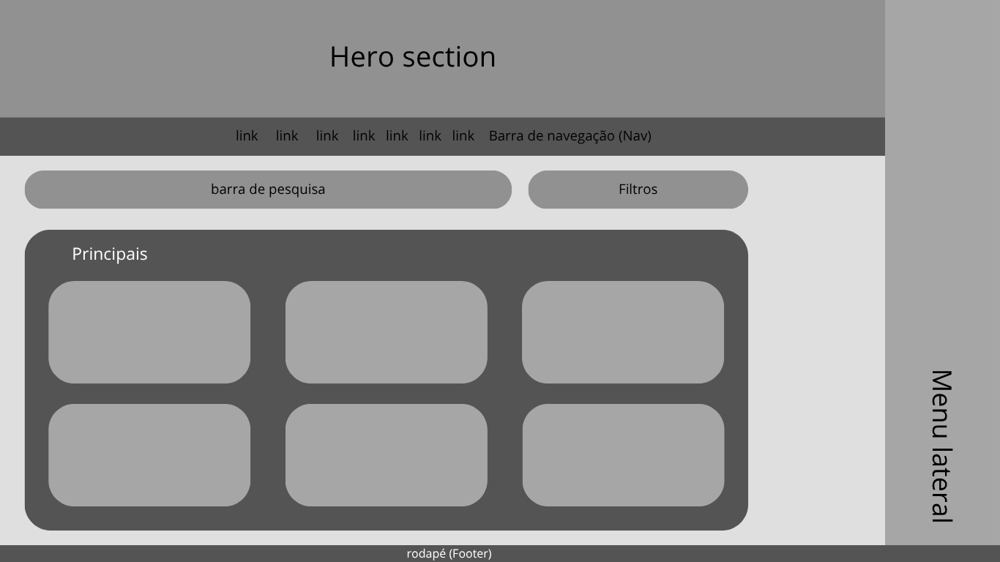
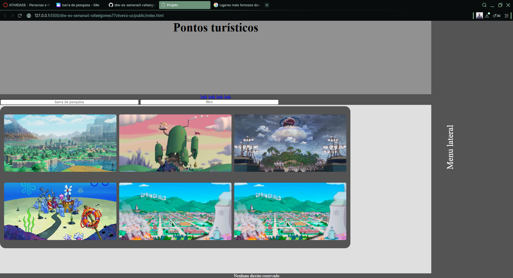

# Trabalho Prático - Semana 04

Dessa vez, vamos escolher uma proposta de projeto para trabalhar.

Nessa atividade, você deverá montar a página inicial do projeto escolhido, a organização do HTML aplicando semântica correta e uso aprimorado do CSS. Leia o enunciado completo no Canvas para mais detalhes.

**IMPORTANTE:** Você deve trabalhar e alterar apenas arquivos dentro da pasta **`public`**. Deixe todos os demais arquivos e pastas desse repositório inalterados. **PRESTE MUITA ATENÇÃO NISSO.**

## Informações Gerais

- Nome: Rafael Gomes Antunes De Oliveira
- Matricula: 1629771
- Proposta de projeto escolhida: Pontos turísticos da ficção
- Breve descrição sobre seu projeto: Um projeto feito com o principal elemento sendo os pontos turisticos mais famosos da animação. Onde pode se encontrar detalhes, personagens e informações de cada lugar.

## Print do(s) wireframe(s) criado

## Print da home-page criada

